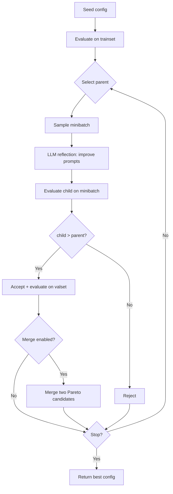

# Optimizer

Based on the [GEPA](https://arxiv.org/abs/2507.19457) algorithm.

## Idea

Agent prompts can be optimized like "genes" in an evolutionary algorithm:

1. **Seed** - the initial agent config (yours or generated) is evaluated on a set of tasks
2. **Mutation** - the LLM analyzes execution results and proposes improved agent instructions. This is called "reflection": the model sees what worked, what failed, and rewrites the prompt
3. **Selection** - the new candidate is evaluated on the same tasks. If it is better than the parent, it is accepted. Otherwise, it is rejected
4. **Merge** - successful prompts from different candidates are combined (crossover). If two candidates share a common ancestor, genealogy-aware merge is used: take the best parts from each without duplication
5. **Repeat** - the cycle continues until convergence or budget exhaustion

Instead of gradients and loss functions, LLM reflection is used. Instead of backpropagation - direct comparison of results on tasks.

## Quick Start

```python
import asyncio
from fedotmas import MAW, Optimizer
from fedotmas.maw.models import MAWAgentConfig, MAWConfig, MAWStepConfig
from fedotmas.optimize import OptimizationConfig

config = MAWConfig(
    agents=[
        MAWAgentConfig(
            name="researcher",
            model="openai/gpt-4o-mini",
            instruction="Research the given topic and provide key facts.",
            output_key="research",
        ),
        MAWAgentConfig(
            name="writer",
            model="openai/gpt-4o-mini",
            instruction="Write a clear summary based on the research.",
            output_key="summary",
        ),
    ],
    pipeline=MAWStepConfig(
        type="sequential",
        children=[
            MAWStepConfig(type="agent", agent_name="researcher"),
            MAWStepConfig(type="agent", agent_name="writer"),
        ],
    ),
)

trainset = [
    "Explain quantum computing basics",
    "Describe how neural networks learn",
    "Summarize the history of the internet",
]

async def main():
    maw = MAW()
    opt = Optimizer(
        maw,
        criteria="Clarity, technical accuracy, and completeness",
        config=OptimizationConfig(
            seed=42,
            max_iterations=5,
            patience=3,
            minibatch_size=2,
        ),
    )

    result = await opt.optimize(trainset, seed_config=config)

    print(f"Best score: {result.best_score:.3f}")
    print(f"Iterations: {result.iterations}")
    print(f"Candidates evaluated: {len(result.all_candidates)}")

asyncio.run(main())
```

What happens here:

* `criteria` defines the evaluation criteria for the LLM judge
* `trainset` - tasks used to evaluate candidates
* `seed_config` - initial agent configuration
* The optimizer runs the pipeline on tasks, evaluates results, mutates prompts, and repeats

## How It Works



At each iteration:

1. A parent is selected from evaluated candidates
2. A minibatch of tasks is sampled from the trainset
3. The proposer calls the LLM for "reflection" - analyzes execution results and proposes improved instructions
4. The new candidate is evaluated on the same minibatch
5. If the child's average score is higher than the parent's, it is accepted and evaluated on the full valset
6. If merge is enabled and there are 2+ candidates on the Pareto front, crossover is attempted

## Configuration

All parameters are set via `OptimizationConfig`:

```python
from fedotmas.optimize import OptimizationConfig

config = OptimizationConfig(
    # Stopping
    max_iterations=20,       # maximum iterations
    patience=5,              # stop after N iterations without improvement
    score_threshold=0.95,    # stop when score threshold is reached
    max_evaluations=100,     # stop after N pipeline runs

    # LLM temperatures
    temperature_reflect=0.7, # mutation creativity
    temperature_merge=0.5,   # merge creativity
    temperature_judge=0.1,   # evaluation consistency

    # Evolution
    candidate_selection="pareto",  # pareto | best | epsilon_greedy
    use_merge=True,                # enable crossover
    max_merge_attempts=5,          # maximum merge operations
    minibatch_size=3,              # tasks per iteration

    # Safety
    llm_timeout=120.0,             # LLM call timeout in seconds
    max_consecutive_failures=3,    # before emergency agent reshuffle

    # Infrastructure
    checkpoint_path="opt_state.json",  # save/restore state
    graceful_shutdown=True,            # SIGINT completes current iteration
    seed=42,                           # reproducibility
)
```

## Custom Scorer

By default, the optimizer uses an LLM judge (`LLMJudge`) to evaluate results based on criteria. You can implement your own scorer, for example for deterministic evaluation:

```python
import re
from fedotmas.optimize import Scorer, ScoringResult

class KeywordScorer(Scorer):
    """Checks for the presence of keywords in the output."""

    KEYWORDS = ["renewable", "cost", "environment", "efficiency"]

    async def evaluate(self, task: str, state: dict) -> ScoringResult:
        text = " ".join(str(v) for v in state.values()).lower()
        found = [kw for kw in self.KEYWORDS if re.search(rf"\b{kw}\b", text)]
        score = len(found) / len(self.KEYWORDS)
        missing = [kw for kw in self.KEYWORDS if kw not in found]

        feedback = f"Found {len(found)}/{len(self.KEYWORDS)} keywords."
        if missing:
            feedback += f" Missing: {', '.join(missing)}."

        return ScoringResult(score=score, feedback=feedback, reasoning=feedback)
```

`Scorer` is a Protocol. Inheriting from it is optional but helpful: IDEs provide hints and type checkers validate the contract. You only need to implement one method: `evaluate(task, state) -> ScoringResult`.

Pass the scorer to `Optimizer`:

```python
opt = Optimizer(maw, scorer=KeywordScorer(), config=OptimizationConfig(...))
```

## Callbacks

Callbacks allow tracking the optimization process. Inherit from `OptimizationCallback` and override the needed methods:

```python
from fedotmas.optimize import OptimizationCallback, MetricsCallback
from fedotmas.optimize._state import Candidate, OptimizationState

class LoggingCallback(OptimizationCallback):
    def on_iteration_start(self, iteration: int, state: OptimizationState) -> None:
        print(f"[iter {iteration}] candidates={len(state.candidates)}")

    def on_candidate_accepted(self, child: Candidate, parent: Candidate) -> None:
        print(f"  ACCEPTED #{child.index} score={child.mean_score or 0:.3f}")

    def on_candidate_rejected(self, child: Candidate, parent: Candidate) -> None:
        print(f"  rejected #{child.index} score={child.mean_score or 0:.3f}")
```

Built-in `MetricsCallback` collects statistics:

```python
metrics_cb = MetricsCallback()

opt = Optimizer(
    maw,
    criteria="...",
    callbacks=[LoggingCallback(), metrics_cb],
    config=OptimizationConfig(...),
)

result = await opt.optimize(trainset, seed_config=config)

m = metrics_cb.metrics
print(f"Accepted: {m.accepted}, Rejected: {m.rejected}")
print(f"Acceptance rate: {m.acceptance_rate:.1%}")
print(f"Cache hits: {m.cache_hits}, misses: {m.cache_misses}")
print(f"Best score history: {m.best_score_history}")
```

Available callback methods:

| Method                                     | When it is called               |
| ------------------------------------------ | ------------------------------- |
| `on_iteration_start(iteration, state)`     | Start of iteration              |
| `on_candidate_evaluated(candidate, tasks)` | Candidate evaluated             |
| `on_candidate_accepted(child, parent)`     | Child is better than parent     |
| `on_candidate_rejected(child, parent)`     | Child is not better than parent |
| `on_merge_attempted(pair)`                 | Attempt to merge two candidates |
| `on_iteration_end(iteration, state)`       | End of iteration                |
| `on_optimization_end(result)`              | Optimization finished           |

## Selection Strategies

The `candidate_selection` parameter determines how the parent is chosen for mutation:

| Strategy             | Behavior                                                              |
| -------------------- | --------------------------------------------------------------------- |
| `"pareto"` (default) | Random selection from Pareto front. Balances exploration/exploitation |
| `"best"`             | Always the best by mean score. Pure exploitation                      |
| `"epsilon_greedy"`   | 90% best, 10% random. Controlled exploration                          |

```python
config = OptimizationConfig(candidate_selection="epsilon_greedy")
```

## Merge

When a candidate is accepted and there are 2+ candidates on the Pareto front, the optimizer attempts to merge their prompts.

Two modes:

* **Genealogy merge** - if candidates share a common ancestor, for each agent we check: which descendant modified the instruction? If only one did, take that version. If both did, call the LLM to merge. This is more efficient than direct merge.
* **Direct merge** - if there is no common ancestor, the LLM combines instructions directly.

```python
config = OptimizationConfig(
    use_merge=True,           # enable (default)
    max_merge_attempts=5,     # maximum merge operations per optimization
)
```

## Checkpoint/Resume

For long optimizations, you can save state to disk and resume later:

```python
import asyncio
from fedotmas import MAW, Optimizer
from fedotmas.optimize import OptimizationConfig

async def main():
    maw = MAW()
    trainset = ["task 1", "task 2", "task 3"]

    # Phase 1: run 3 iterations
    opt1 = Optimizer(
        maw,
        criteria="Quality",
        config=OptimizationConfig(
            seed=42,
            checkpoint_path="optimizer_state.json",
            max_iterations=3,
            patience=10,
        ),
    )
    result1 = await opt1.optimize(trainset, seed_config=config)
    print(f"Phase 1: {result1.iterations} iterations, score={result1.best_score:.3f}")

    # Phase 2: resume from checkpoint, run 3 more
    opt2 = Optimizer(
        maw,
        criteria="Quality",
        config=OptimizationConfig(
            seed=42,
            checkpoint_path="optimizer_state.json",  # same file
            max_iterations=6,                         # total limit
            patience=10,
        ),
    )
    result2 = await opt2.optimize(trainset, seed_config=config)
    print(f"Phase 2: {result2.iterations} iterations, score={result2.best_score:.3f}")

asyncio.run(main())
```

The state includes all candidates, their scores, genealogy, and iteration number.

## Stopping Criteria

Optimization stops when the first condition is met:

| Parameter                | Description                                                       |
| ------------------------ | ----------------------------------------------------------------- |
| `max_iterations=20`      | Hard iteration limit                                              |
| `patience=5`             | Stop after N iterations without improvement                       |
| `score_threshold=0.95`   | Stop when threshold is reached                                    |
| `max_evaluations=100`    | Stop after N pipeline runs                                        |
| `graceful_shutdown=True` | SIGINT/SIGTERM completes current iteration instead of abrupt exit |

## Result

`OptimizationResult` contains all optimization data:

```python
result = await opt.optimize(trainset, seed_config=config)

# Best configuration - ready to use
best_config: MAWConfig = result.best_config
best_score: float = result.best_score

# All candidates with genealogy
for c in result.all_candidates:
    print(f"#{c.index} origin={c.origin} parent={c.parent_index} score={c.mean_score}")

# Pareto front - set of non-dominated candidates
for c in result.pareto_front():
    print(f"#{c.index} score={c.mean_score:.3f}")

# Stats
print(f"Iterations: {result.iterations}")
print(f"Total pipeline runs: {result.total_evaluation_runs}")
print(f"Tokens: {result.total_prompt_tokens} prompt / {result.total_completion_tokens} completion")
```
